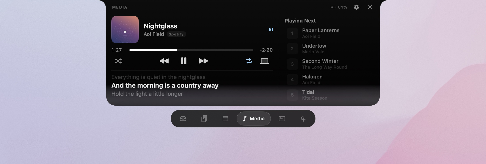
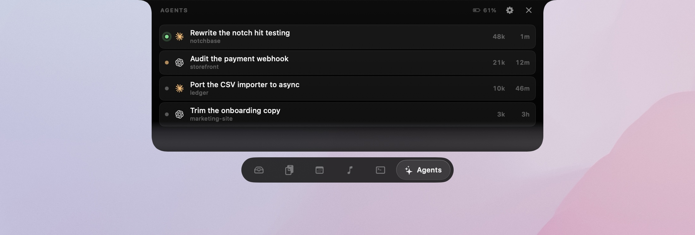
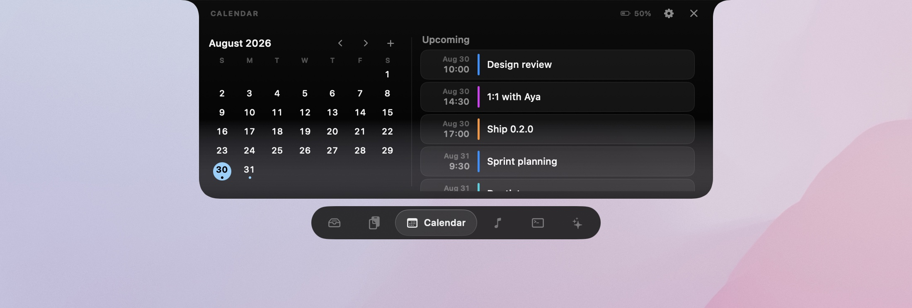
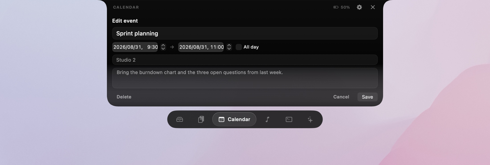
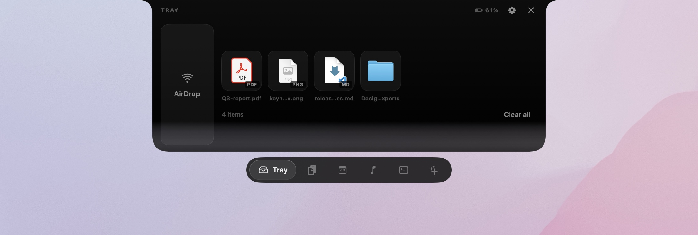
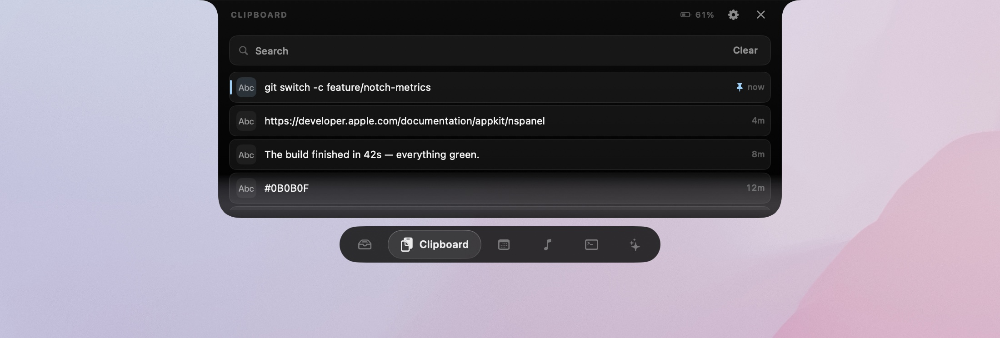
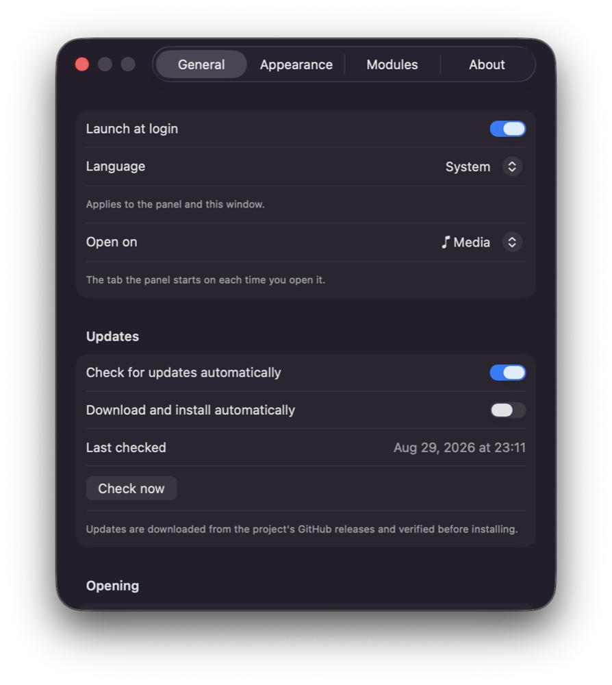

<h1 align="center">Notchbase</h1>

  The MacBook notch, turned into a working surface. 
  Hover it and a panel comes out. Move away and it goes back in.

  

  <a href="#install">Install</a> ·
  <a href="#tabs">Tabs</a> ·
  <a href="#settings">Settings</a> ·
  <a href="#permissions">Permissions</a>

There is no window to manage and no Dock icon. Notchbase sits in the menu bar, opens on
hover, and closes the moment the pointer leaves. When it is closed, a strip narrower than
the notch itself shows the album art of what is playing, or a checkmark when a coding agent
finishes a turn — and when there is nothing to say, it draws nothing at all and you see the
bare hardware notch.

  

> The screenshots on this page use fictional files, clips, sessions and events.

## Install

Download the latest `Notchbase-<version>.zip` from [Releases](../../releases), unzip, and
move `Notchbase.app` to `/Applications`.

The app is not notarised, so macOS blocks the first launch with *"Notchbase" cannot be
opened*. Dismiss it, then open **System Settings › Privacy & Security**, scroll to Security
and click **Open Anyway** next to Notchbase. Authenticate, and launch the app again. macOS
asks once; right-clicking → *Open* no longer works for this on macOS 15 and later.

Requires macOS 15 or later. A Mac with a notch is ideal but not required — notchless displays
get a Dynamic Island style strip in the same position.

After that Notchbase keeps itself up to date. It checks for new releases in the background
and offers to download and install them; signatures are verified before anything is
replaced. Automatic checks, silent installs and a manual *Check for Updates…* all live in
Settings › General › Updates and in the menu bar icon's menu. Updates installed this way
skip the Gatekeeper prompt above — it only appears on the copy you download by hand.

## Tabs

Six of them, in whatever order you like — and any you do not want are switched off in
Settings so they never appear.

### Media

Apple Music and Spotify, whichever is playing. Artwork, a scrubber that counts down the time
remaining, shuffle and repeat, and the system output device. Lyrics come from LRCLIB and
follow the playhead line by line, with the line just gone still faintly visible above the
current one; they scroll by hand too. On the right, what is coming up next — click any of it
to jump straight there without bringing the player forward.

Clicking the artwork or the title raises the player app itself.

### Agents

Every Claude Code and Codex session on the machine, newest first, with live status: green
for mid-turn, amber for waiting on you, grey for done. Token counts and time since the last
activity sit on the right. Click a session and the project opens in Claude or ChatGPT — or in
Terminal, the built-in shell, or your editor, whichever you picked.

### Calendar

A month at a fixed six weeks, so the grid never reflows as you page through it, next to the
week ahead. Dots mark days with events. Click any day and the list jumps to that week.

Events are editable in place. **+** starts a new one on the selected day, and clicking any
event in the list opens it — title, times, all-day, location and notes, with the calendar to
file it under when it is new. Delete asks once before it goes. The panel stays open while
you are editing rather than sliding away when the pointer leaves. Events in read-only
calendars, like subscribed holidays, open but cannot be changed; a repeating event is edited
for that occurrence only.

### Tray

Drag files toward the notch and the panel opens to meet them. Drop to stash, drag back out
whenever you need them, or drop straight onto the AirDrop zone to send. Files are either
copied in, so moving the original does not break anything, or kept as references.

### Clipboard

Searchable history with pinning. Click an entry and it is pasted where your cursor already
is. Anything a password manager marks concealed or transient is never recorded in the first
place.

### Terminal

A real shell, running the one your account uses, that keeps going when the panel closes. Any
folder in the Tray can be opened straight into it.

## Settings

  

Reachable from the menu bar icon, in English or Japanese.

| Pane | What is in it |
|---|---|
| **General** | Language, the tab it opens on, hover and tab-switch delays, automatic updates, how long a reopen still counts as resuming |
| **Appearance** | Which tabs are shown and in what order (drag to reorder), how far the lower edge dissolves into the desktop, the tab switcher's transparency and glass style, animation speed |
| **Modules** | AirDrop zone, copy-or-reference for dropped files, clipboard limit, lyric offset, queue length, agent history window, where sessions open, shell |
| **About** | Version, permissions, credits, and a full reset |

## Permissions

Everything is optional; refusing one only disables that module.

| Feature | Permission |
|---|---|
| Media, lyrics | Automation (Music / Spotify) |
| Calendar | Calendar full access |
| Clipboard paste | Accessibility |

Nothing leaves the machine except lyric lookups to [LRCLIB](https://lrclib.net) and, if you
connect it, the Spotify queue request.

## Spotify queue

Spotify exposes the current track to other apps but not the queue, so "Playing Next" needs a
free Spotify app of your own. *Settings → Modules → Media* walks through it:

1. **Open dashboard** — create an app at developer.spotify.com. Any name and description
   will do; tick **Web API**.
2. **Copy** the redirect URI `http://127.0.0.1:8888/callback` and paste it into the app's
   *Redirect URIs* field.
3. Paste the app's **Client ID** back into Notchbase and press *Connect*. A browser tab asks
   you to approve, and that is the last you see of it.

Everyone needs their own Client ID rather than a shared one. A new Spotify app stays in
development mode until Spotify grants it extended quota, and in that mode only accounts the
app's owner has added by hand are allowed to sign in — your own app has no such limit for
you.

Authorization uses PKCE, so there is no client secret anywhere in Notchbase. The only scope
requested is `user-read-playback-state`, and the refresh token is stored in your home
folder, readable only by you.

Apple Music needs no setup, and neither does anything else in the app.

## Limitations

- Only Music and Spotify are visible to the app; browser playback is not.
- Lyrics come from LRCLIB, so coverage depends on what the community has uploaded.
- Agent usage limits are not shown: neither Claude Code nor Codex publishes them anywhere
  Notchbase can read.
- There is no public API for display brightness, so volume and brightness HUDs are left to
  the system.

## Credits

- [Sparkle](https://sparkle-project.org) — MIT
- [SwiftTerm](https://github.com/migueldeicaza/SwiftTerm) — MIT
- [LRCLIB](https://lrclib.net) — community lyrics
- [Simple Icons](https://simpleicons.org) — CC0 icon paths. The Claude and OpenAI marks
  remain trademarks of Anthropic and OpenAI; Notchbase is not affiliated with either.

## License

MIT — see [LICENSE](LICENSE).
